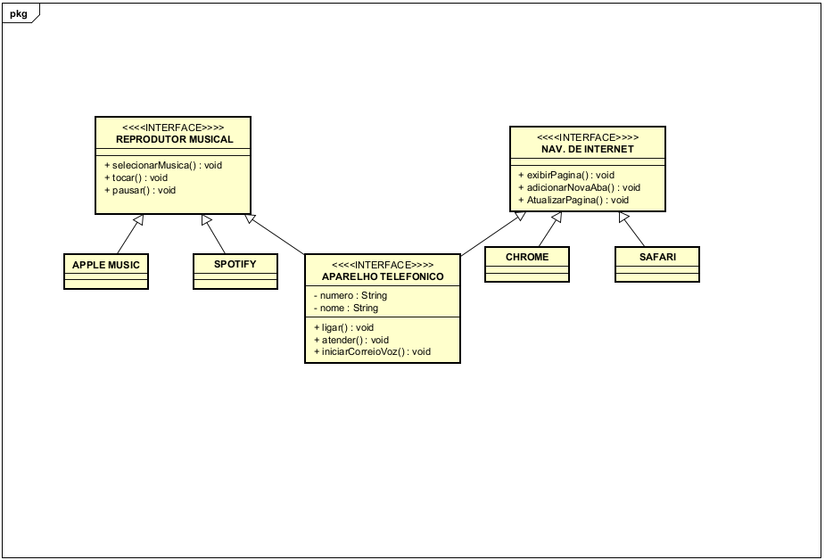

# Diagrama-o-de-classes-iphone
Realizado o desafio da DIO em parceria com o Bradesco do módulo de POO.

## Projeto de diagramação de classe em java.

Foi assistido o video de lançamento do iphone em 2007. Logo, foi contruido um diagrama de classes conforme pedido em aula e depois condificado em java, simulando as caracteristicas apresentadas em vídeo, como.
- Reprodutor musical: tocar, pausar, selecionar musica;
- Aparelho telefônico: ligar, atender, iniciarCorreioVoz;
- Navegador de internet: ExibirPagina, adicionarNovaAba, atualizarPagina;

## Diagrama de classes

